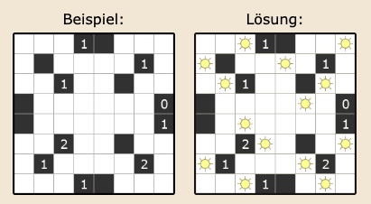
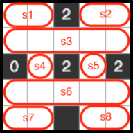

# Akari

A solver for [Akari](https://www.janko.at/Raetsel/Akari) Puzzles that uses the [z3](https://github.com/Z3Prover/z3) SMT prover.

## Table Of Contents

-   [Introduction](#introduction)
-   [Usage](#usage)
-   [Documentation](#docs)

<a name="introduction"></a>

## Introduction

> Akari (美術館, びじゅつかん, Bijutsukan, Light Up, Lighting) is a Japanese logic puzzle: place lamps in such a way that all squares are illuminated and lamps do not illuminate each other..



There are 3 rules for the puzzle:

1. Place light bulbs in some of the white cells so that all white cells are lit and no light bulb is lit by an other light bulb.
2. A light bulb shines horizontally and vertically up to the next black cell or the edge of the grid.
3. A number in a black cell indicates how many light bulbs must be placed in orthogonally adjacent cells.

<a name="usage"></a>

## Usage

Create a build using the following command:

```sh
cargo build --release
```

Pass the puzzle to be solved via stdin...

...from a file:

```sh
cat puzzles/074.txt | ./target/release/akari
```

... or from [www.janko.at](www.janko.at) using `curl`:

```sh
curl -v --silent https://www.janko.at/Raetsel/Akari/523.a.htm 2>&1 | sed -n -e '/problem/,/solution/ p' | sed -e '1d;$d' | ./target/release/akari
```

<a name="docs"></a>

## Documentation

In the following the construction of the formulas are described, these are implemented in [src/ankari.rs:91-238](https://github.com/cbl/akari/blob/9791015a71fb643c7111b9e6e39de102c63ffe8b/src/akari.rs#L91-L238).

The list `S` of variables is given by one or more stripes in each row, marking a range within the line that may contain **one** lamp. The domain of each strip `s ∈ S` is given by `s >= s_start && s <= s_end` where `s == s_end` means that no lamp is placed on the strip.



The strips ensure that no lamps iluminate each other across lines. Now it must be ensured that bulbs do not illuminate each other across rows:

Two strips that lie across the same column cannot have the same value unless they are not placed on the board (`s == s_end`) or there is a black square between them. So for column `0` we would have the following rules:

```sh
(¬(s1 == s1_end) ∧ ¬(s2 == s2_end)) -> ¬((s1 == 0) ∧ (s2 == 0))
```

Rule 3 is given by the following constraints:

For the neighboring strips of a black field with a number `n ∈ {0,1,2,3,4}` the condition is fulfilled if in `n` neighboring strips bulbs are placed directly next to the black field implies that the other neighbors cannot be occupied with lamps.

This would result in the following rules for the field at position (0, 2) with the value `n=2` from the example above:

```sh
(s1 ∧ s2) <-> ¬s3
(s1 ∧ s3) <-> ¬s2
(s2 ∧ s3) <-> ¬s1
```

Finally, it must be ensured that a strip can only be empty if all fields of the strip are illuminated by strips below or above it. This leads to the following rules for `s1`:

```sh
(s2 == s_end) -> ((s3 == 3) ∨ (s5 == 3) ∨ (s5 == 3) ∨ (s6 == 3) ∨ (s8 == 3))
(s2 == s_end) -> (s3 == 4)
```